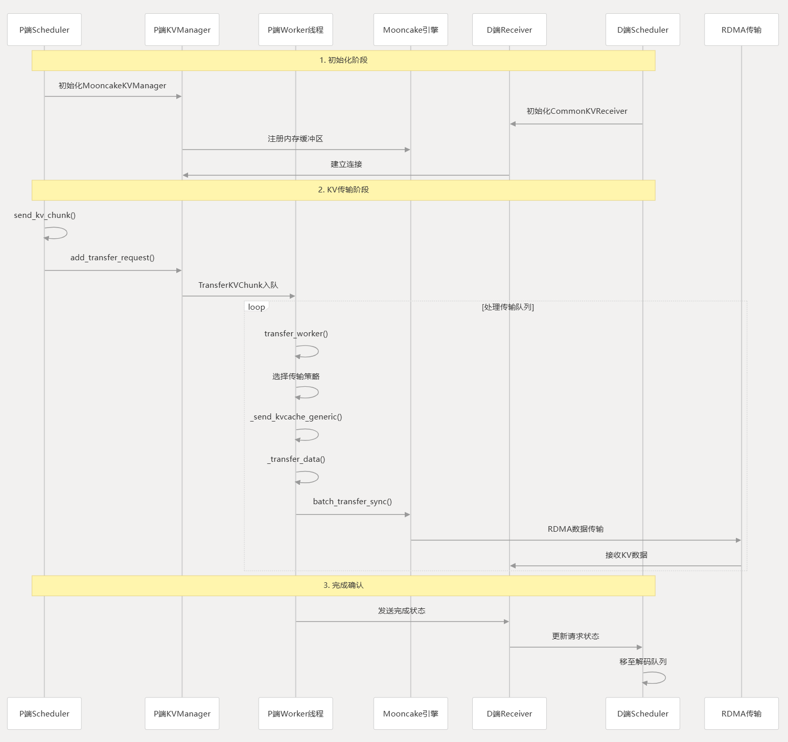

# **Mooncake的初始化**

## **传输引擎初始化流程**

| 调用层级 | 函数/方法 | 文件位置 | 行数 | 触发条件 | 主要功能 |
| --- | --- | --- | --- | --- | --- |
| 1 | `ModelRunner.__init__()` | `python/sglang/srt/model_executor/model_runner.py` | 432-461 | SGLang 服务器启动 | 初始化模型运行器 |
| 2 | `init_shared_mooncake_transfer_engine()` | `python/sglang/srt/model_executor/model_runner.py` | 1103-1146 | 满足 Mooncake 使用条件 | 判断是否要创建共享传输引擎 |
| 3 | `init_mooncake_transfer_engine()` | `python/sglang/srt/distributed/device_communicators/mooncake_transfer_engine.py` | 264-281 | 需要 Mooncake 传输 | 创建或复用全局传输引擎实例 |
| 4 | `MooncakeTransferEngine.__init__()` | `python/sglang/srt/distributed/device_communicators/mooncake_transfer_engine.py` | 93-123 | 传输引擎对象首次构造 | 创建底层 `mooncake.engine.TransferEngine` 并完成初始化 |
| 5 | `MooncakeTransferEngine.initialize()` | `python/sglang/srt/distributed/device_communicators/mooncake_transfer_engine.py` | 146-206 | 构造后立即调用 | 选择 RDMA / Ascend 初始化参数 |

### 1. 什么时候会初始化 Mooncake

`ModelRunner.init_shared_mooncake_transfer_engine()` 不是无条件创建引擎，而是先根据 server args 判断是否真的需要 Mooncake。当前触发条件主要有四类：

```python
use_mooncake_te = (
    (
        self.server_args.disaggregation_mode != "null"
        and self.server_args.disaggregation_transfer_backend == "mooncake"
    )
    or (
        self.server_args.enable_hierarchical_cache
        and self.server_args.hicache_storage_backend == "mooncake"
        and envs.SGLANG_HICACHE_MOONCAKE_REUSE_TE.get()
    )
    or (
        self.server_args.encoder_only
        and self.server_args.encoder_transfer_backend == "mooncake"
    )
    or (
        self.server_args.language_only
        and self.server_args.encoder_transfer_backend == "mooncake"
    )
    or (
        self.server_args.enable_elastic_expert_backup
        and self.server_args.elastic_ep_backend is not None
    )
)
```

这里可以理解为：只要某条数据通路明确要求用 Mooncake，或者 elastic expert backup 依赖 Mooncake，就会进入初始化流程。

### 2. 初始化参数从哪里来

`init_mooncake_transfer_engine()` 的签名是：

```python
def init_mooncake_transfer_engine(
    hostname: str,
    gpu_id: Optional[int] = None,
    ib_device: Optional[str] = None,
) -> MooncakeTransferEngine:
```

这三个参数分别表示：

`hostname`：本机地址，通常来自 `get_local_ip_auto()`，用于生成 Mooncake session id 和对外注册本机服务。

`gpu_id`：当前进程绑定的 GPU 编号。它会传给 `MooncakeTransferEngine`，用于区分不同 rank / GPU 的初始化上下文，也会参与 IB 设备映射。

`ib_device`：IB 设备名或者设备映射配置。上层一般从 `server_args.disaggregation_ib_device` 或 `server_args.mooncake_ib_device` 里取值，若为空则使用默认值。

在 `ModelRunner` 里，实际调用是这样的：

```python
init_mooncake_transfer_engine(
    hostname=get_local_ip_auto(),
    gpu_id=self.gpu_id,
    ib_device=(
        self.server_args.disaggregation_ib_device
        or self.server_args.mooncake_ib_device
    ),
)
```

### 3. 单例是怎么实现的

这里的“单例”不是通过类继承实现的，而是通过模块级全局变量缓存实现的：

```python
# Module-level shared engine instance, set by init_mooncake_transfer_engine().
_mooncake_transfer_engine: Optional["MooncakeTransferEngine"] = None
```

`init_mooncake_transfer_engine()` 的逻辑很直接：

```python
global _mooncake_transfer_engine
if _mooncake_transfer_engine is not None:
    return _mooncake_transfer_engine
_mooncake_transfer_engine = MooncakeTransferEngine(
    hostname=hostname, gpu_id=gpu_id, ib_device=ib_device
)
return _mooncake_transfer_engine
```

也就是说：

1. 第一次调用时创建 `MooncakeTransferEngine`。
2. 后续再调用，直接返回同一个对象。
3. `parallel_state.get_mooncake_transfer_engine()` 只是一个读接口，它不会创建新实例，只负责返回当前缓存的共享对象。

这个设计的目的很明确：SGLang 的多个模块可能都需要 Mooncake，但底层传输引擎应该只初始化一次，避免重复创建 RPC 端口、重复绑定 GPU、重复初始化传输层状态。

### 4. `MooncakeTransferEngine.__init__()` 做了什么

Python 侧的包装类在构造时会先导入 `mooncake.engine.TransferEngine`，然后创建底层引擎对象：

```python
self.engine = TransferEngine()
self.hostname = hostname
self.gpu_id = gpu_id if gpu_id is not None else 0
self.ib_device = get_ib_devices_for_gpu(ib_device, self.gpu_id)

self.initialize(
    hostname=self.hostname,
    device_name=self.ib_device,
)
self.session_id = NetworkAddress(
    self.hostname, self.engine.get_rpc_port()
).to_host_port_str()
```

这里可以重点看两点：

1. `get_ib_devices_for_gpu(...)` 会把用户传入的 IB 配置解析成当前 GPU 该使用的设备字符串。
2. `session_id` 不是外部传进来的，而是通过 `hostname + rpc_port` 生成的，后续 `batch_transfer_sync()` 会用它标识这次传输会话。

### 5. `initialize()` 真正传给底层的参数

`MooncakeTransferEngine.initialize()` 才是把 Python 参数翻译到底层 C++ engine 初始化参数的地方。它的行为可以概括为：

```python
if envs.ENABLE_ASCEND_TRANSFER_WITH_MOONCAKE.get():
    hostname += f":{get_free_port()}:npu_{...}"
    self.engine.initialize(hostname, "P2PHANDSHAKE", "ascend", device_name)
else:
    self.engine.initialize(hostname, "P2PHANDSHAKE", "rdma", device_name)
```

所以底层初始化的关键参数是：

`hostname`：服务地址，Ascend 路径下还会追加随机端口和 NPU 标识。

`P2PHANDSHAKE`：固定的连接/握手模式字符串。

`rdma` / `ascend`：传输协议类型，由环境变量决定。

`device_name`：具体使用的 IB / 设备配置。

### 6. 初始化后的复用点

`get_mooncake_transfer_engine()` 会被多个上层模块直接拿来复用，例如：

* `ModelRunner` 在模型初始化时按需创建。
* `conn.py` 在 Mooncake disaggregation 连接路径里直接读取共享引擎。
* `expert_backup_manager.py` 和 `encode_server.py` 也会优先复用已创建的引擎。

因此，Mooncake 在 SGLang 里更像“全局共享传输基础设施”，而不是每个请求单独 new 一个对象。

### 7. 总结

Mooncake 初始化链路可以概括为：

`ModelRunner` 判断是否需要 Mooncake -> `init_mooncake_transfer_engine()` 创建或复用单例 -> `MooncakeTransferEngine.__init__()` 构造底层引擎 -> `initialize()` 选择 RDMA / Ascend 并完成底层连接参数配置。

* 支持 RDMA 和 Ascend 两种传输协议。
* 单例通过模块级全局变量 `_mooncake_transfer_engine` 实现。
* `hostname`、`gpu_id`、`ib_device` 是上层传下来的核心初始化参数。
* `get_mooncake_transfer_engine()` 只负责获取已初始化实例，不负责创建。

* 自定义内存池类型包括 NVLINK、BAREX 和 INTRA_NODE_NVLINK，和传输引擎是并列的底层资源配置。

* MooncakeStore 在配置匹配时会重用已初始化的传输引擎。


# **Mooncake的调用**



## P端传输流程

P 端的主路径是先在 Prefill 阶段拆分并整理 KV chunk，再由 MooncakeKVManager 统一入队，最后在 transfer_worker 中调用底层传输引擎完成批量 RDMA 发送。

| 调用层级 | 函数/方法 | 文件位置 | 行数 | 触发条件 | 主要功能 |
| --- | --- | --- | --- | --- | --- |
| 1 | Scheduler.send_kv_chunk() | python/sglang/srt/disaggregation/prefill.py | 744-822 | Prefill 完成 chunk 处理 | 准备 KV 索引并触发传输 |
| 2 | CommonKVSender.send() | python/sglang/srt/disaggregation/common/conn.py | - | 调用发送接口 | 将传输请求交给公共发送通道 |
| 3 | MooncakeKVManager.add_transfer_request() | python/sglang/srt/disaggregation/mooncake/conn.py | 1554-1597 | 出现新的传输请求 | 构造 TransferKVChunk 并入队 |
| 4 | MooncakeKVManager.transfer_worker() | python/sglang/srt/disaggregation/mooncake/conn.py | 1146-1304 | 队列中存在待处理任务 | 消费传输队列并处理请求 |
| 5 | send_kvcache() | python/sglang/srt/disaggregation/mooncake/conn.py | 687-703 | 走标准 TP 配置路径 | 发起标准 KV 传输 |
| 6 | _send_kvcache_generic() | python/sglang/srt/disaggregation/mooncake/conn.py | 579-685 | 进入通用传输逻辑 | 构建传输块并调用底层接口 |
| 7 | _transfer_data() | python/sglang/srt/disaggregation/mooncake/conn.py | 570-577 | 传输块已准备完成 | 调用底层 RDMA 传输 |
| 8 | engine.batch_transfer_sync() | python/sglang/srt/distributed/device_communicators/mooncake_transfer_engine.py | 223-252 | 执行批量传输 | 完成最终的数据发送 |

```python
def _transfer_data(self, mooncake_session_id, transfer_blocks):  
    if not transfer_blocks:  
        return 0  
    src_addrs, dst_addrs, lengths = zip(*transfer_blocks)  
    return self.engine.batch_transfer_sync(  
        mooncake_session_id, list(src_addrs), list(dst_addrs), list(lengths)  
    )
```

## D端接收流程

D 端不直接“拉取”数据，而是在 Decode 主循环里持续轮询状态、回收已完成的传输请求，并把这些请求重新送回后续调度流程。

| 调用层级 | 函数/方法 | 文件位置 | 主要作用 |
| --- | --- | --- | --- |
| 1 | event_loop_normal_disagg_decode / event_loop_overlap_disagg_decode | python/sglang/srt/disaggregation/decode.py:1174-1234 | Decode 端主事件循环，驱动整个解码流程 |
| 2 | process_decode_queue | python/sglang/srt/disaggregation/decode.py:1331-1363 | 处理解码队列，包括预分配和传输轮询 |
| 3 | DecodeTransferQueue.pop_transferred | python/sglang/srt/disaggregation/decode.py:1084-1168 | 从传输队列中弹出已完成传输的请求 |
| 4 | poll_and_all_reduce / poll_and_all_reduce_with_staging | python/sglang/srt/disaggregation/utils.py:83-104 | 轮询所有 receiver 并同步状态 |
| 5 | MooncakeKVReceiver.poll | python/sglang/srt/disaggregation/mooncake/conn.py:1869-1893 | 检查 KV 缓存传输状态 |

## 关键接收机制说明

### 1. 底层自动接收

Mooncake 的 RDMA 传输是双向的。P 端调用 `batch_transfer_sync()` 后，D 端的 Mooncake 引擎会把数据自动接收到预注册的内存缓冲区中，对应实现位于 python/sglang/srt/disaggregation/mooncake/conn.py。

### 2. 状态同步机制

D 端通过 ZMQ socket 接收 P 端发送的传输完成状态消息，对应逻辑位于 python/sglang/srt/disaggregation/mooncake/conn.py。

* 接收 `bootstrap_room, status, prefill_rank` 消息

* 更新本地请求状态

* 通知上层调度器

### 3. 轮询检查

`MooncakeKVReceiver.poll()` 会定期检查传输状态，并在状态收敛后返回最终结果。

```python
def poll(self) -> KVPoll:  
    if self.conclude_state is None:  
        status = self.kv_mgr.check_status(self.bootstrap_room)  
        if status in (KVPoll.Success, KVPoll.Failed):  
            self.conclude_state = status  
    return status if self.conclude_state is not None else status
```


# **Mooncake的数据传输**

## Python 接口

Mooncake 的 Python 接口可以按同步/异步、单条/批量来理解。

| Python 接口 | 绑定方法 | 典型用途 | 说明 |
| --- | --- | --- | --- |
| `transfer_sync` | `TransferEnginePy::transferSync` | 单条同步传输 | 直接传输一对 buffer |
| `batch_transfer_sync` | `TransferEnginePy::batchTransferSync` | 通用批量同步传输 | 通过 `opcode` 区分读写 |
| `batch_transfer_sync_write` | `TransferEnginePy::batchTransferSyncWrite` | KV 发送、写回 | 批量写入远端地址 |
| `batch_transfer_sync_read` | `TransferEnginePy::batchTransferSyncRead` | 模型加载、读取 | 批量从远端读取数据 |
| `batch_transfer_async_write` | `TransferEnginePy::batchTransferAsyncWrite` | 异步写入 | 返回 batch id，后续轮询状态 |
| `batch_transfer_async_read` | `TransferEnginePy::batchTransferAsyncRead` | 异步读取 | 返回 batch id，后续轮询状态 |

## `batch_transfer_sync` 后续调用链

这里描述的是 `batch_transfer_sync` 进入 Mooncake 之后的内部调用流程。

```text
Python API: batch_transfer_sync
    -> TransferEnginePy::batchTransferSync()
    -> engine_->allocateBatchID()
    -> engine_->submitTransfer() / engine_->submitTransferWithNotify()
    -> engine_->getBatchTransferStatus()  (循环轮询直到 COMPLETED/FAILED/TIMEOUT)
    -> engine_->freeBatchID()
```

其中，状态判定发生在 `getBatchTransferStatus()`，资源回收发生在 `freeBatchID()`。

| 步骤 | 函数名 | 文件位置 | 主要操作 |
| --- | --- | --- | --- |
| 1 | `batch_transfer_sync` | Python API | 用户调用入口，接收目标主机、缓冲区列表等参数 |
| 2 | `batchTransferSync` | `mooncake-integration/transfer_engine/transfer_engine_py.cpp` | 获取或创建段句柄，校验输入参数，构建 `TransferRequest` 列表 |
| 3 | `allocateBatchID` | `mooncake-integration/transfer_engine/transfer_engine_py.cpp` | 分配 Batch ID 用于跟踪本次传输 |
| 4 | `submitTransfer` / `submitTransferWithNotify` | `mooncake-integration/transfer_engine/transfer_engine_py.cpp` | 提交传输任务到传输引擎 |
| 5 | `getBatchTransferStatus` | `mooncake-integration/transfer_engine/transfer_engine_py.cpp` | 轮询传输状态直到完成、失败或超时 |
| 6 | `freeBatchID` | `mooncake-integration/transfer_engine/transfer_engine_py.cpp` | 释放 Batch ID 和相关资源 |

## RDMA 分支与 NVLink 分支举例

从 `batch_transfer_sync` 后续调用链中的 `submitTransfer()` 继续展开时，会按协议分支到不同 transport。

RDMA 分支示例：

```text
TransferEngine::submitTransfer()
    -> MultiTransport::submitTransfer()
    -> RdmaTransport::submitTransfer()
    -> RdmaTransport::submitTransferTask()
    -> RdmaContext::submitPostSend()
    -> RdmaEndPoint::submitPostSend()
    -> ibv_post_send
```

NVLink 分支示例：

```text
TransferEngine::submitTransfer()
    -> MultiTransport::submitTransfer()
    -> NvlinkTransport::submitTransfer()
    -> 构造并处理 Slice
    -> cudaMemcpy / cudaMemcpyAsync
```

这两条分支共享同一个提交入口，但最底层原语不同：RDMA 落到 InfiniBand verbs（`ibv_post_send`），NVLink 落到 CUDA 拷贝接口（`cudaMemcpy` 或 `cudaMemcpyAsync`）。

## 为什么 NVLink 传输需要额外内存管理

核心原因是：Mooncake 的 NVLink 传输在 Fabric 模式下不仅要“拷贝数据”，还要“跨进程/跨节点共享同一段显存”。这要求内存能够导出并导入共享句柄，而普通 `cudaMalloc` 内存不总是满足这一点。这里的“额外内存管理”主要由 `NVLinkAllocator` 实现。

### 1. 根本原因：CUDA VMM vs 普通 cudaMalloc

在 `NvlinkTransport::registerLocalMemory()` 中，Fabric 路径会先调用 `cuMemRetainAllocationHandle`：

```cpp
auto result = cuMemRetainAllocationHandle(&handle, addr);
if (result != CUDA_SUCCESS) {
    LOG(WARNING) << "Memory region " << addr
                 << " is not allocated by cuMemCreate, "
                 << "but it can be used as local buffer";
    return 0;
}
```

这个判断的含义是：如果该地址不是由 CUDA VMM（如 `cuMemCreate`）体系分配，就拿不到可导出的 allocation handle。这样内存最多可做本地 buffer，不能稳定作为远端可访问内存。

### 2. NVLink 传输为何依赖额外内存管理

NVLink 传输真正依赖的是“可共享内存对象 + 映射 + 权限管理”这套机制，而不只是 `cudaMemcpy` 调用本身。

Mooncake 在 Fabric 模式下的关键步骤是：

1. 通过 VMM 分配可导出内存对象（`cuMemCreate`，带 `CU_MEM_HANDLE_TYPE_FABRIC`）。
2. 导出共享句柄（`cuMemExportToShareableHandle`）。
3. 对端导入并映射（`cuMemImportFromShareableHandle` + `cuMemMap`）。
4. 为设备设置访问权限（`cuMemSetAccess`）。

这些步骤都在 `nvlink_transport.cpp` 的注册/重映射流程中体现：本端注册时导出 handle，对端在 `relocateSharedMemoryAddress()` 中导入并重映射。

### 3. NVLinkAllocator 与 PyTorch 默认分配器的核心差异

| 特性 | PyTorch 默认（`cudaMalloc`） | `NVLinkAllocator`（`mc_nvlink_malloc`） |
| --- | --- | --- |
| 底层 API | `cudaMalloc` | CUDA VMM: `cuMemCreate` + `cuMemAddressReserve` + `cuMemMap` |
| 可获取 Fabric 句柄 | 不支持 | **支持**（`CU_MEM_HANDLE_TYPE_FABRIC`） |
| 可导出跨节点共享 | 不支持 | **支持**（`cuMemExportToShareableHandle`） |
| P2P 访问权限 | 仅当前 GPU | **对系统中所有 GPU 开放读写** |

### 4. SGLang 的传输链路

```text
SGLang 设置 SGLANG_MOONCAKE_CUSTOM_MEM_POOL
    -> NVLinkAllocator 通过 CUDAPluggableAllocator 替换 PyTorch 默认 cudaMalloc
    -> 相关传输内存通过 cuMemCreate + CU_MEM_HANDLE_TYPE_FABRIC 分配
    -> registerLocalMemory() 成功调用 cuMemRetainAllocationHandle
    -> cuMemExportToShareableHandle 导出 CUmemFabricHandle
    -> 远端节点 cuMemImportFromShareableHandle 导入并映射该内存
    -> cudaMemcpy(cudaMemcpyDefault) 实现 P2P NVLink 传输
```

### 5. 两种 NVLink 模式说明
代码支持两种机制，在启动时自动检测：

| 模式 | 触发条件 | 共享机制 | 内存要求 |
| --- | --- | --- | --- |
| **Fabric 模式**（新） | GPU 支持 `CU_DEVICE_ATTRIBUTE_HANDLE_TYPE_FABRIC_SUPPORTED`（H100/GH200 等） | `cuMemExportToShareableHandle` | **必须是 `cuMemCreate` 分配的 VMM 内存** |
| **IPC 模式**（旧） | 不支持 Fabric 或设置 `MC_USE_NVLINK_IPC=1` | `cudaIpcGetMemHandle` | 普通 `cudaMalloc` 即可 |

旧版 IPC 模式（单机多 GPU）用普通 PyTorch 内存是可以的，但新版 Fabric 模式（多节点 NVLink，如 NVSwitch 集群）则**必须使用 NVLinkAllocator**。


